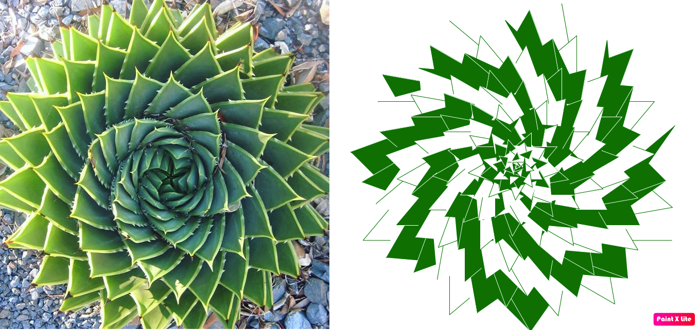

## Simple Recursion Examples
- Overview
- Recursion Breakdown
- Disadvantages
- Examples
   - Multiplication using Repeated Addition
   - X to the power of Y
   - Add all numbers in sequence till X (single recursion)
   - Add all numbers in sequence (multiple recursion)
   - Reverse a string
   

### Overview

[Recursion](https://everything2.com/index.pl?node_id=477013) is a simple and elegant concept in programming, yet many programmers including experienced ones find it hard to take that recursive [leap of faith](https://www.reddit.com/r/compsci/comments/44syr6/understanding_the_recursive_leap_of_faith/). Most text book examples start and end with fibonacci series or the factorial examples. This is my attempt to simplify the concept with better examples and also to bring out the various patterns that are employed in recursion.

Before we jump into the simple examples, curious minds will spot recursion in everything around them. These could be the universe (galaxies), flowers or even plants (a spiral aloe vera) as shown below. These [fractal patterns](https://en.wikipedia.org/wiki/Fractal) helps us visualize recursion. This is particularly useful in observing how minor changes to the recursion parameters and expressions can completely change the visual pattern and the outcome.

[Here](https://github.com/1kautilya1/SimpleRecursionExamples/blob/master/SimpleRecursionExamples/spiral_aloevera.py) is the recursive code to generate the spiral aloe vera.

### Recursion Breakdown
Every recursive solution can be broken down into following components
- [X] Understand the size of the problem. This involves identifying the input, output and relationship between them. The size of the problem can be seen as the **total number of operations** that the algorithms need in order to solve our problem. This number can be directly related to the input parameter or one of its attribute (such as length of a list).
- [X] One or more **base conditions (cases)** that allows the recursive call to terminate. It must also be noted that base cases are **specific (smaller) instances of the problem** and it will never contain a recursive call. If multiple base cases yield the same output, they can be combined using an OR or a AND operation. If base cases yield different outputs then one can put them in a cascading if..else structure.
- [X] An **expression** or logic that involves decreasing the size of the problem and helps us arrive closer to the base condition/s
- [X] One or more Recursive **calls to self**, typically a complex divide and conquer problem can have multiple recursive calls, whereas the ones we have here such as string reversal, repeated addition, etc., have a single recursive call.
- [X] Recursive calls could be embedded within the function or it could be a [tail call](https://en.wikipedia.org/wiki/Tail_call)
- [X] One or more **parameters** passed to the recursive call. The number of parameters depends on the logic you employ to arrive at the solution and also the various base conditions that you may employ. 

### Disadvantages
- Any function call, whether it is recursive or not, allocates memory on the program stack to store certain information on it, such as input parameters, return type, etc., This means a certain amount of overhead which can make recursive programs **slower** and on occasions run the risk of running into a **stack overflow error**.
- Recursive programs are harder to analyze and **difficult to debug**, this becomes even more apparent when you do have multiple recursive calls within your function.
- Functional programming languages have native support for [tail recursion](https://en.wikipedia.org/wiki/Tail_call). If the last instruction of a function is always a recursive call, then there is no need to store the current call context information on the stack. Instead, we only replace the parameters of the call and head straight back to the beginning of the function. One should be mindful of this, especially if you are not using functional programming languages.

### [Multiplication using Repeated Addition](https://github.com/1kautilya1/SimpleRecursionExamples/blob/master/SimpleRecursionExamples/Multiplication.cs)

Inputs: 5, 4

Base Condition | Expression | # of Recursive Calls | # of parameters
-------------- | ---------- | ------------------------- | --------------------
y == 1         | return x + RepeatedAddition(x, y - 1); | 1 | 2

Start building call stack as show below

`= 5 + RepeatedAddition(5, 4 - 1)`

`= 5 + RepeatedAddition(5, 4 - 1) + RepeatedAdditions(5, 3 - 1)`

`= 5 + RepeatedAddition(5, 4 - 1) + RepeatedAdditions(5, 3 - 1) + RepeatedAdditions(5, 2 - 1)`

Now call stack gets unwinded by executing the calls

`= 5 + RepeatedAddition(5, 4 - 1) + RepeatedAdditions(5, 3 - 1) + 5`

`= 5 + RepeatedAddition(5, 4 - 1) + 5 + 5`

`= 5 + 5 + 5 + 5`

`= 20`

### [X to the power of Y](https://github.com/1kautilya1/SimpleRecursionExamples/blob/master/SimpleRecursionExamples/PowRecursion.cs)

Inputs: 5, 4

Base Condition | Expression | # of Recursive Calls | # of parameters
-------------- | ---------- | ------------------------- | --------------------
y == 1         | return x * PowRecursion(x, y - 1); | 1 | 2

Start building call stack as show below

`= 5 * PowRecursion(5, 4 - 1)`

`= 5 * PowRecursion(5, 4 - 1) * PowRecursion(5, 3 - 1)`

`= 5 * PowRecursion(5, 4 - 1) * PowRecursion(5, 3 - 1) * PowRecursion(5, 2 - 1)`

Now call stack gets unwinded by executing the calls

`= 5 * PowRecursion(5, 4 - 1) * PowRecursion(5, 3 - 1) + 5`

`= 5 * PowRecursion(5, 4 - 1) * 5 * 5`

`= 5 * 5 * 5 * 5`

`= 625`

### [Add all numbers in sequence till X (single recursion)](https://github.com/1kautilya1/SimpleRecursionExamples/blob/master/SimpleRecursionExamples/AddSequence.cs)

Input: 5

Base Condition | Expression | # of Recursive Calls | # of parameters
-------------- | ---------- | ------------------------- | --------------------
x == 1         | return x + AddSequenceTill(x - 1); | 1 | 1

Start building call stack as show below

`= 5 + AddSequenceTill(5 - 1)`

`= 5 + AddSequenceTill(5 - 1) + AddSequenceTill(4 - 1)`

`= 5 + AddSequenceTill(5 - 1) + AddSequenceTill(4 - 1) + AddSequenceTill(3 - 1)`

`= 5 + AddSequenceTill(5 - 1) + AddSequenceTill(4 - 1) + AddSequenceTill(3 - 1) + AddSequenceTill(2 - 1)`

Now call stack gets unwinded by executing the calls

`= 5 + AddSequenceTill(5 - 1) + AddSequenceTill(4 - 1) + AddSequenceTill(3 - 1) + 1`

`= 5 + AddSequenceTill(5 - 1) + AddSequenceTill(4 - 1) + 2 + 1`

`= 5 + AddSequenceTill(5 - 1) + 3 + 2 + 1`

`= 5 + 4 + 3 + 2 + 1`

`= 15`

### [Add all numbers in sequence (multiple recursion)](https://github.com/1kautilya1/SimpleRecursionExamples/blob/master/SimpleRecursionExamples/AddSequence2.cs)

Input: { 5, 4, 3, 2, 1 }

Base Condition | Expression | # of Recursive Calls | # of parameters
-------------- | ---------- | ------------------------- | --------------------
a.Length == 0; a.Length == 1 | return AddSequenceTill(a1) + AddSequenceTill(a2); | **2** | 1

Start building call stack as show below

`= AddSequenceTill({5, 4}) + AddSequenceTill({3, 2, 1})`

`= AddSequenceTill({5}) + AddSequenceTill({4}) + AddSequenceTill({3, 2} + AddSequenceTill({1}))`

`= AddSequenceTill({5}) + AddSequenceTill({4}) + AddSequenceTill({3}) + AddSequenceTill({2}) + AddSequenceTill({1})`

Now call stack gets unwinded by executing the calls

`= AddSequenceTill({5}) + AddSequenceTill({4}) + AddSequenceTill({3}) + AddSequenceTill({2}) + AddSequenceTill({1})`

`= 5 + AddSequenceTill({4}) + AddSequenceTill({3}) + AddSequenceTill({2}) + AddSequenceTill({1})`

`= 5 + 4 + AddSequenceTill({3}) + AddSequenceTill({2}) + AddSequenceTill({1})`

`= 5 + 4 + 3 + AddSequenceTill({2}) + AddSequenceTill({1})`

`= 5 + 4 + 3 + 2 + AddSequenceTill({1})`

`= 5 + 4 + 3 + 2 + 1`

`= 15`

### [Reverse a string](https://github.com/1kautilya1/SimpleRecursionExamples/blob/master/SimpleRecursionExamples/StringReverse.cs)

Input: "Hello"

Base Conditions | Expression | # of Recursive Calls | # of parameters
-------------- | ---------- | ------------------------- | --------------------
s == string.Empty; s.Length == 1 | return s[s.Length - 1] + Reverse(s.Substring(0, s.Length - 1)); | 1 | 1

`= 'o' + Reverse("Hell")`

`= 'o' + Reverse("Hell") + Reverse("Hel")`

`= 'o' + Reverse("Hell") + Reverse("Hel") + Reverse("He")`

`= 'o' + Reverse("Hell") + Reverse("Hel") + Reverse("He") + Reverse("H")`

Now call stack gets unwinded by executing the calls

`= 'o' + 'l' + Reverse("Hel") + Reverse("He") + Reverse("H")`

`= 'o' + 'l' + 'l' + Reverse("He") + Reverse("H")`

`= 'o' + 'l' + 'l' + 'e' + Reverse("H")`

`= 'o' + 'l' + 'l' + 'e' + 'H'`

`= 'olleH'`

